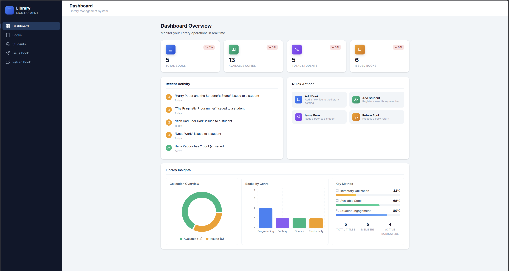
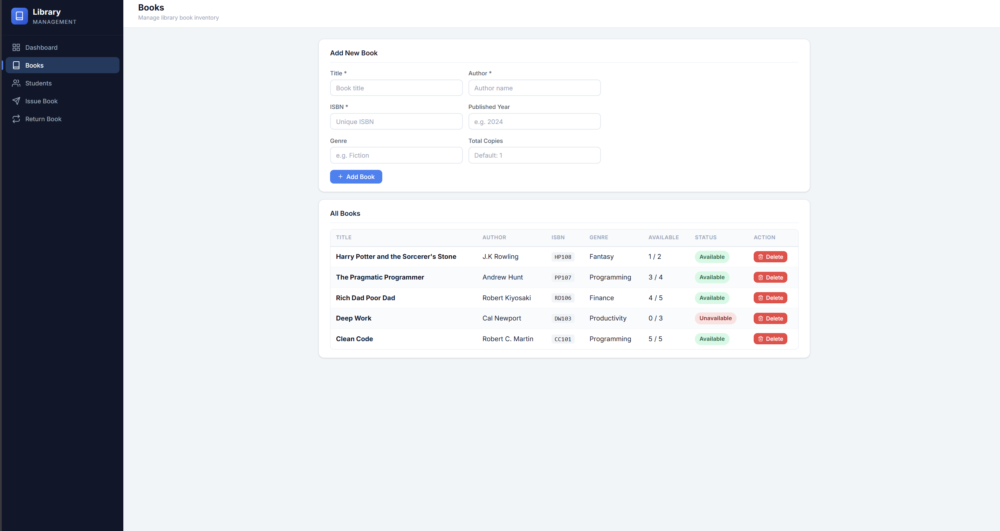
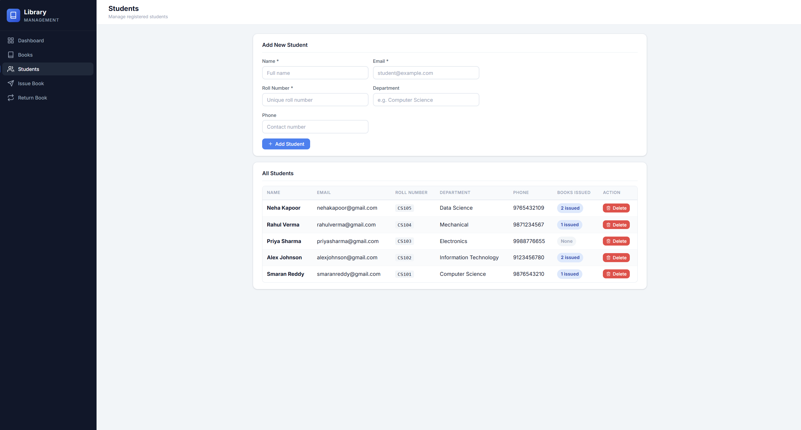

# Library Management System

A full-stack **MERN** application for managing library books, student records, book issuing/returning workflows, and real-time inventory tracking. Built with **Node.js**, **Express.js**, **MongoDB**, **Mongoose**, **React**, and **Vite**.

---

## Features

| Feature | Description |
|---|---|
| **Book Management** | Create, read, update, and delete books with title, author, ISBN, genre, and copy tracking |
| **Student Management** | Register and manage students with name, email, roll number, department, and phone |
| **Issue / Return Workflow** | Issue books to students and process returns with atomic inventory updates |
| **Inventory Tracking** | Real-time tracking of total copies, available copies, and issued books |
| **Dashboard Statistics** | Aggregated stats: total books, available copies, total students, issued count |
| **Atomic Inventory Updates** | `$inc` with conditional queries prevents oversubscribing copies under concurrency |
| **Rollback Handling** | Automatic rollback of inventory changes if a related operation fails, maintaining consistency |
| **Responsive Frontend** | React-based UI with sidebar navigation, stat cards, and activity timeline |
| **RESTful APIs** | Clean REST endpoints with consistent JSON responses |
| **MongoDB Atlas Integration** | Cloud database ready via `MONGODB_URI` environment variable |
| **Error Handling & Validation** | Centralized error middleware, custom `AppError` class, mongoose validation |

---

## Tech Stack

### Frontend

| Technology | Purpose |
|---|---|
| [React](https://react.dev/) | UI component library |
| [Vite](https://vitejs.dev/) | Build tool and dev server |
| [Axios](https://axios-http.com/) | HTTP client with interceptors |
| [React Icons](https://react-icons.github.io/react-icons/) | Icon library |
| [Recharts](https://recharts.org/) | Charting library for library insights |
| CSS | Custom stylesheets |

### Backend

| Technology | Purpose |
|---|---|
| [Node.js](https://nodejs.org/) | JavaScript runtime (ES6 Modules) |
| [Express.js](https://expressjs.com/) | Web framework |
| [MongoDB](https://www.mongodb.com/) | NoSQL database |
| [Mongoose](https://mongoosejs.com/) | ODM with schema validation and populate |
| [Nodemon](https://nodemon.io/) | Dev server with auto-restart |
| [dotenv](https://github.com/motdotla/dotenv) | Environment variable management |

---

## Project Architecture

```
┌─────────────────────────────────────────────────────────┐
│                    Frontend (React + Vite)               │
│  ┌──────────┐  ┌──────────┐  ┌──────────┐  ┌────────┐ │
│  │Dashboard │  │  Books   │  │ Students │  │Issue/  │ │
│  │          │  │  (CRUD)  │  │  (CRUD)  │  │Return  │ │
│  └──────────┘  └──────────┘  └──────────┘  └────────┘ │
│         │             │             │             │      │
│         └─────────────┴──────┬──────┴─────────────┘      │
│                              │ Axios HTTP                │
│                     ┌────────┴────────┐                  │
│                     │   api.js (API   │                  │
│                     │    Service)     │                  │
│                     └────────┬────────┘                  │
└──────────────────────────────┼──────────────────────────┘
                               │ REST API calls
┌──────────────────────────────┼──────────────────────────┐
│                   Backend (Express.js)                   │
│                     ┌────────┴────────┐                  │
│                     │    app.js       │                  │
│                     │  (Route Setup)  │                  │
│                     └────────┬────────┘                  │
│          ┌───────────────────┼───────────────────┐       │
│          ▼                   ▼                   ▼       │
│  ┌────────────┐    ┌────────────┐    ┌────────────┐     │
│  │ /api/books │    │/api/students│    │/api/library│     │
│  │  Routes    │    │   Routes   │    │   Routes   │     │
│  └─────┬──────┘    └─────┬──────┘    └─────┬──────┘     │
│        ▼                 ▼                 ▼             │
│  ┌────────────┐    ┌────────────┐    ┌────────────┐     │
│  │   Book     │    │  Student   │    │  Library   │     │
│  │ Controller │    │ Controller │    │ Controller │     │
│  └─────┬──────┘    └─────┬──────┘    └─────┬──────┘     │
│        └─────────────────┼─────────────────┘            │
│                          ▼                              │
│                 ┌────────────────┐                      │
│                 │    MongoDB     │                      │
│                 │  (Mongoose)   │                      │
│                 └────────────────┘                      │
└─────────────────────────────────────────────────────────┘
```

---

## Folder Structure

```
library-management-api/
│
├── src/                          # Backend source
│   ├── config/
│   │   └── db.js                 # MongoDB connection setup
│   ├── controllers/
│   │   ├── bookController.js     # Book CRUD logic
│   │   ├── studentController.js  # Student CRUD logic
│   │   └── libraryController.js  # Issue/Return business logic
│   ├── middleware/
│   │   └── errorMiddleware.js    # Custom AppError, 404 handler, global error handler
│   ├── models/
│   │   ├── Book.js               # Book schema (title, author, isbn, copies, etc.)
│   │   └── Student.js            # Student schema (name, email, issuedBooks ref, etc.)
│   ├── routes/
│   │   ├── bookRoutes.js         # /api/books endpoints
│   │   ├── studentRoutes.js      # /api/students endpoints
│   │   └── libraryRoutes.js      # /api/library endpoints
│   ├── app.js                    # Express app setup, middleware, route mounting
│   └── server.js                 # Entry point, DB connect, server start
│
├── frontend/                     # Frontend source (React + Vite)
│   ├── src/
│   │   ├── components/
│   │   │   ├── Dashboard.jsx         # Dashboard overview with stats, activity, insights
│   │   │   ├── BookForm.jsx          # Add/edit book form
│   │   │   ├── BookList.jsx          # Book inventory table
│   │   │   ├── StudentForm.jsx       # Add/edit student form
│   │   │   ├── StudentList.jsx       # Student directory table
│   │   │   ├── IssueBookForm.jsx     # Issue book form
│   │   │   ├── ReturnBookForm.jsx    # Return book form
│   │   │   ├── Sidebar.jsx           # Navigation sidebar
│   │   │   ├── StatCard.jsx          # Statistics card widget
│   │   │   ├── RecentActivity.jsx    # Recent activity timeline
│   │   │   ├── QuickActions.jsx      # Quick action shortcuts
│   │   │   ├── LibraryInsights.jsx   # Charts and insights panel
│   │   │   ├── LoadingSkeleton.jsx   # Loading skeleton UI
│   │   │   └── ConfirmModal.jsx      # Confirmation dialog
│   │   ├── services/
│   │   │   └── api.js               # Axios instance with interceptors
│   │   ├── styles/
│   │   │   └── app.css              # Application styles
│   │   ├── App.jsx                  # Root component with routing
│   │   └── main.jsx                 # Vite entry point
│   ├── index.html
│   ├── vite.config.js
│   └── package.json
│
├── .env                          # Environment variables
├── .gitignore
├── package.json                  # Backend dependencies
└── README.md
```

---

## API Endpoints

### Books

| Method | Endpoint | Description |
|---|---|---|
| `GET` | `/api/books` | Get all books |
| `GET` | `/api/books/:id` | Get a single book by ID |
| `POST` | `/api/books` | Create a new book |
| `PUT` | `/api/books/:id` | Update a book by ID |
| `DELETE` | `/api/books/:id` | Delete a book by ID |

### Students

| Method | Endpoint | Description |
|---|---|---|
| `GET` | `/api/students` | Get all students |
| `GET` | `/api/students/:id` | Get a single student by ID |
| `POST` | `/api/students` | Create a new student |
| `PUT` | `/api/students/:id` | Update a student by ID |
| `DELETE` | `/api/students/:id` | Delete a student by ID |

### Library (Issue / Return)

| Method | Endpoint | Description |
|---|---|---|
| `POST` | `/api/library/issue/:studentId/:bookId` | Issue a book to a student |
| `POST` | `/api/library/return/:studentId/:bookId` | Return a book from a student |

### Health

| Method | Endpoint | Description |
|---|---|---|
| `GET` | `/api/health` | Health check |

---

## Important Backend Concepts Implemented

### Atomic Operations
Book inventory updates use MongoDB's `$inc` operator combined with a conditional filter (`copiesAvailable: { $gt: 0 }`) inside `findOneAndUpdate`. This guarantees that the available copies count never drops below zero, even under concurrent requests.

### Race Condition Prevention
The issue flow performs the availability check **and** the decrement in a single atomic database operation. A second safety net validates the operation result — if `findOneAndUpdate` returns `null`, the last available copy was taken between the read and write, and the request is rejected.

### Promise.all Optimization
Related documents (student and book) are fetched in parallel using `Promise.all` at the start of both issue and return operations, minimizing database round-trip latency.

```js
const [student, book] = await Promise.all([
  Student.findById(studentId),
  Book.findById(bookId),
]);
```

### Rollback Consistency Handling
Both issue and return flows implement try/catch blocks with explicit rollback logic. If the student document update fails after the book inventory has already been modified, the inventory change is automatically reverted to maintain data consistency.

```js
try {
  await Student.findByIdAndUpdate(studentId, { $push: { issuedBooks: bookId } });
} catch (studentUpdateError) {
  // Rollback: restore the decremented copy
  await Book.findByIdAndUpdate(bookId, { $inc: { copiesAvailable: 1 } });
  throw studentUpdateError;
}
```

### MongoDB Populate
The `Student` model references `Book` documents via ObjectId in the `issuedBooks` array. Mongoose's `.populate('issuedBooks')` can be used to eagerly load full book details when querying student records.

### Centralized Error Handling
A global error handling middleware catches all errors thrown or passed via `next(err)`. A custom `AppError` class attaches HTTP status codes to errors. 404 handling for unknown routes is also centralized.

### Validation Handling
Mongoose schema-level validators (`required`, `unique`, `min`, `trim`, `lowercase`) enforce data integrity. Invalid MongoDB ObjectId formats are caught via `CastError` handling in controllers.

---

## Frontend Features

### Dynamic Dashboard
The dashboard aggregates data from both `/api/books` and `/api/students` in parallel, computing real-time statistics (total books, available copies, total students, issued books) displayed in animated stat cards.

### Real-time Stats
`StatCard` components update dynamically whenever the dashboard mounts. A refresh key system in `App.jsx` ensures book and student lists re-fetch data after any mutation (create, update, delete, issue, return).

### Responsive UI
The layout uses CSS with a collapsible sidebar (`Sidebar.jsx`) that toggles via a hamburger menu on mobile viewports. The dashboard adapts between single-column and multi-column grids.

### API Integration via Axios
All HTTP communication is centralized in `api.js`, which creates a pre-configured Axios instance with:
- Base URL set to `/api`
- JSON content-type headers
- Response interceptor that unwraps `response.data` for consistent consumption
- Error interceptor that extracts server error messages into rejected promises

### Component-Based Architecture
The frontend is organized into 14 focused components, each with a single responsibility:

| Component | Purpose |
|---|---|
| `Dashboard` | Main overview with stats grid, activity feed, quick actions, insights |
| `BookForm` / `BookList` | Book CRUD UI |
| `StudentForm` / `StudentList` | Student CRUD UI |
| `IssueBookForm` / `ReturnBookForm` | Issue and return workflows |
| `Sidebar` | Navigation with page switching |
| `StatCard` | Reusable metric display card |
| `RecentActivity` | Activity timeline feed |
| `QuickActions` | Shortcut buttons for common tasks |
| `LibraryInsights` | Recharts-based data visualizations |
| `LoadingSkeleton` | Skeleton loading placeholders |
| `ConfirmModal` | Reusable confirmation dialog |

---

## Screenshots

> _Placeholder — add screenshots of your running application here._

| Page | Screenshot |
|---|---|
| **Dashboard** |  |
| **Books Page** |  |
| **Students Page** |  |
| **Issue / Return Page** |  |

---

## Installation

### Prerequisites

- [Node.js](https://nodejs.org/) v18+ 
- [npm](https://www.npmjs.com/) v9+
- A [MongoDB Atlas](https://www.mongodb.com/atlas) cluster (or local MongoDB instance)

### 1. Clone the Repository

```bash
git clone https://github.com/your-username/library-management-api.git
cd library-management-api
```

### 2. Backend Setup

```bash
# Install backend dependencies
npm install

# Create environment file
cp .env.example .env   # or create .env manually
```

### 3. Frontend Setup

```bash
cd frontend
npm install
cd ..
```

### 4. MongoDB Atlas Setup

1. Create a free cluster on [MongoDB Atlas](https://www.mongodb.com/atlas)
2. Get your connection string from Atlas → Clusters → Connect → Connect your application
3. Add it to the `.env` file as `MONGODB_URI`

### 5. Environment Variables

Create a `.env` file in the project root:

```env
MONGODB_URI=mongodb+srv://<username>:<password>@cluster0.xxxxx.mongodb.net/library?retryWrites=true&w=majority
PORT=5000
NODE_ENV=development
```

---

## Run Commands

### Backend

```bash
# Development mode (with auto-restart via Nodemon)
npm run dev

# Production mode
npm start
```

The API server will start at `http://localhost:5000`.

### Frontend

```bash
cd frontend
npm run dev
```

The Vite dev server will start at `http://localhost:5173` with proxy forwarding `/api` requests to the backend.

---

## Future Improvements

- [ ] **JWT Authentication** — Secure endpoints with JSON Web Tokens
- [ ] **Role-Based Access Control** — Admin, librarian, and student roles
- [ ] **MongoDB Transactions** — Use ACID transactions for multi-document atomicity
- [ ] **Search & Filtering** — Full-text search on books and students
- [ ] **Pagination** — Paginated list endpoints for large datasets
- [ ] **Analytics Charts** — Advanced visualizations with borrowing trends and popular books
- [ ] **Email Notifications** — Automated emails for due dates and overdue reminders
- [ ] **Book Reservation** — Allow students to reserve checked-out books

---

## Author

**Smaran Reddy**

- GitHub: [@smaranreddy](https://github.com/smaranreddy)

---

## License

```
MIT License

Copyright (c) 2026 Smaran Reddy

Permission is hereby granted, free of charge, to any person obtaining a copy
of this software and associated documentation files (the "Software"), to deal
in the Software without restriction, including without limitation the rights
to use, copy, modify, merge, publish, distribute, sublicense, and/or sell
copies of the Software, and to permit persons to whom the Software is
furnished to do so, subject to the following conditions:

The above copyright notice and this permission notice shall be included in all
copies or substantial portions of the Software.

THE SOFTWARE IS PROVIDED "AS IS", WITHOUT WARRANTY OF ANY KIND, EXPRESS OR
IMPLIED, INCLUDING BUT NOT LIMITED TO THE WARRANTIES OF MERCHANTABILITY,
FITNESS FOR A PARTICULAR PURPOSE AND NONINFRINGEMENT. IN NO EVENT SHALL THE
AUTHORS OR COPYRIGHT HOLDERS BE LIABLE FOR ANY CLAIM, DAMAGES OR OTHER
LIABILITY, WHETHER IN AN ACTION OF CONTRACT, TORT OR OTHERWISE, ARISING FROM,
OUT OF OR IN CONNECTION WITH THE SOFTWARE OR THE USE OR OTHER DEALINGS IN THE
SOFTWARE.
```
